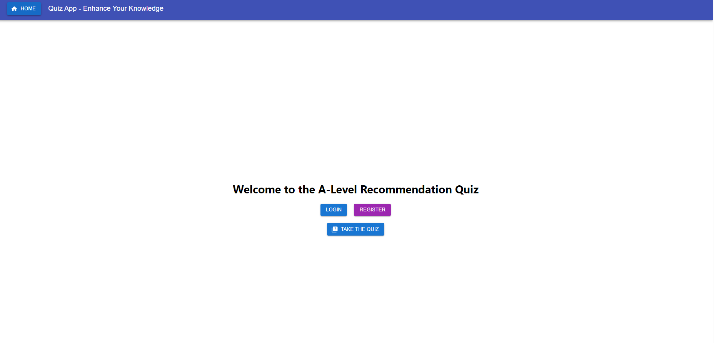
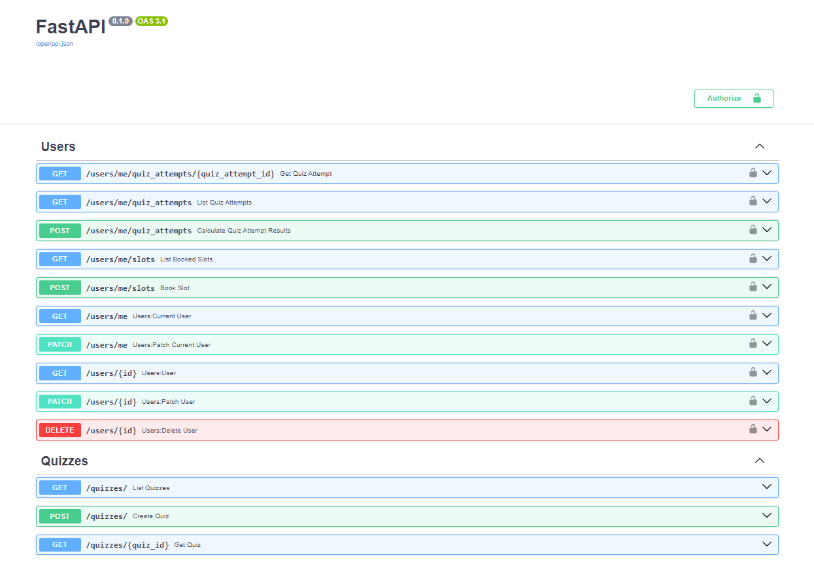
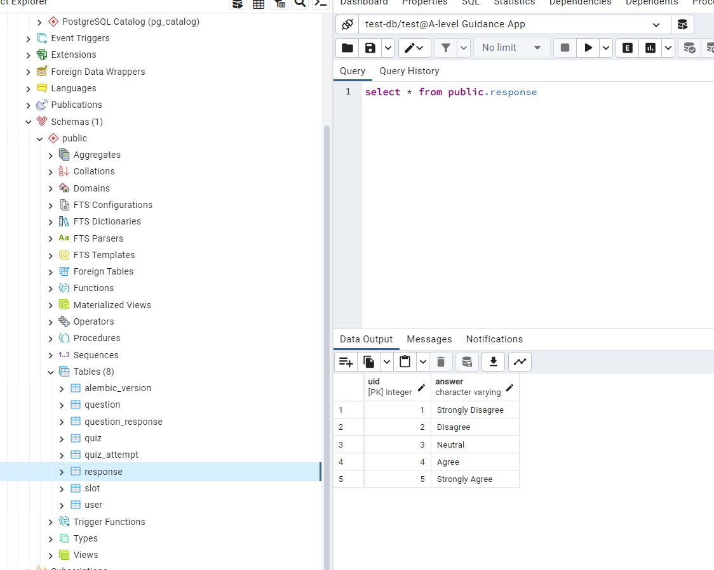

# a-level-guidance-app
A-Level-Guidance-App aids GCSE students in the UK with A-level choices. Using an algorithm, it recommends subjects based on user input. Additionally, it offers mentorship options. A tool to simplify the pivotal A-level selection process.

## Getting Started

This project uses docker-compose to run the frontend, backend and database in separate containers. 
To run the project, you will need to install docker and docker-compose.
Once you have installed docker and docker-compose, the first step is to build the project by running the command in the root directory of the project:

```bash
docker-compose build
```

Once the project is built succesfully, you can run the project by running the following command:

```bash
docker-compose up
```

To run specific containers, you can use the following commands:

```bash
# To start the frontend on localhost:3000
docker-compose up frontend
# To start the backend (can access the swagger docs on localhost:5000/docs)
docker-compose up backend
# To start the database (can access the database on localhost:5432)
docker-compose up postgres
```

To stop the containers, you can use `ctrl +c` or if you ran the containers silently use the following command:

```bash
docker-compose down
```

## Example Images

### Frontend
- 

### Backend
- 

### Database
- 